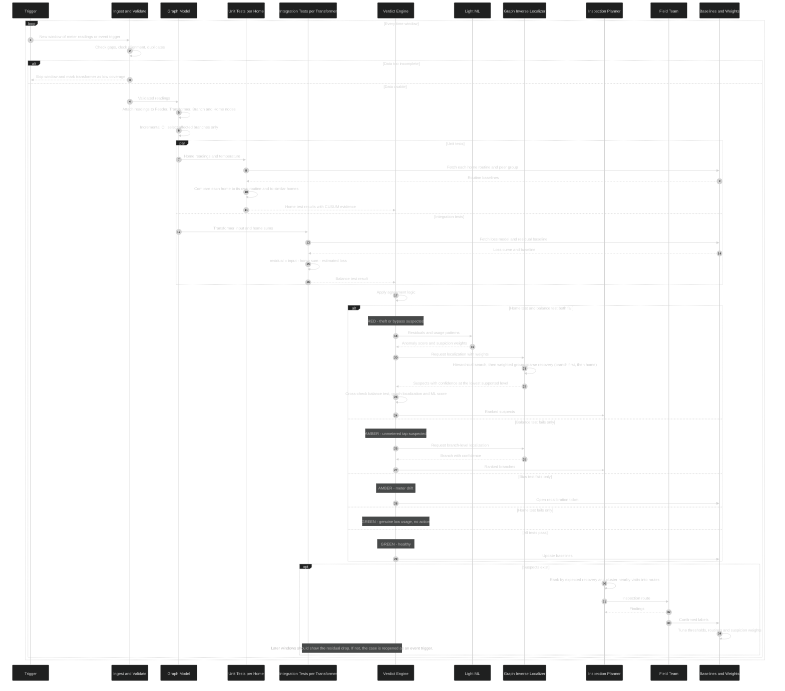

# Vedathon_2.0
<h2>GridCI Architecture</h2>

# System Architecture

```mermaid
%%{init: {'theme': 'dark'}}%%
%% Diagram 4: One CI run as a UML sequence diagram
sequenceDiagram
    %% Number every message so judges can follow the order
    autonumber
    %% ---------- Participants ----------
    %% Starts each run
    participant TRG as Trigger
    %% Lint step for incoming data
    participant VAL as Ingest and Validate
    %% The network tree
    participant GRF as Graph Model
    %% Per-home routine tests
    participant UT as Unit Tests per Home
    %% Per-transformer balance tests
    participant IT as Integration Tests per Transformer
    %% Combines test results into a verdict
    participant VRD as Verdict Engine
    %% Light ML anomaly score and suspicion weights (NEW)
    participant ML as Light ML
    %% Narrows suspects down the tree
    participant BIS as Graph Inverse Localizer
    %% Ranks and routes inspections
    participant PLN as Inspection Planner
    %% The people who inspect
    participant FLD as Field Team
    %% Stored baselines and learned weights
    participant MDL as Baselines and Weights
    %% ---------- One run per time window ----------
    loop Every time window
        %% A new window of readings arrives (scheduler, or event trigger such as a residual spike or reopened case)
        TRG->>VAL: New window of meter readings or event trigger
        VAL->>VAL: Check gaps, clock alignment, duplicates
        alt Data too incomplete
            VAL-->>TRG: Skip window and mark transformer as low coverage
        else Data usable
            VAL->>GRF: Validated readings
            GRF->>GRF: Attach readings to Feeder, Transformer, Branch and Home nodes
            %% Only retest what changed (NEW)
            GRF->>GRF: Incremental CI: select affected branches only
            par Unit tests
                GRF->>UT: Home readings and temperature
                UT->>MDL: Fetch each home routine and peer group
                MDL-->>UT: Routine baselines
                UT->>UT: Compare each home to its own routine and to similar homes
                UT-->>VRD: Home test results with CUSUM evidence
            and Integration tests
                GRF->>IT: Transformer input and home sums
                IT->>MDL: Fetch loss model and residual baseline
                MDL-->>IT: Loss curve and baseline
                IT->>IT: residual = input - home sum - estimated loss
                IT-->>VRD: Balance test result
            end
            VRD->>VRD: Apply agreement logic
            alt Home test and balance test both fail
                Note over VRD: RED - theft or bypass suspected
                %% Light ML supplies the weights for the solver (NEW)
                VRD->>ML: Residuals and usage patterns
                ML-->>VRD: Anomaly score and suspicion weights
                VRD->>BIS: Request localization with weights
                %% Updated: hierarchical search + weighted group-sparse recovery
                BIS->>BIS: Hierarchical search, then weighted group-sparse recovery (branch first, then home)
                BIS-->>VRD: Suspects with confidence at the lowest supported level
                %% Cross-check before final suspects (NEW)
                VRD->>VRD: Cross-check balance test, graph localization and ML score
                VRD->>PLN: Ranked suspects
            else Balance test fails only
                Note over VRD: AMBER - unmetered tap suspected
                VRD->>BIS: Request branch-level localization
                BIS-->>VRD: Branch with confidence
                VRD->>PLN: Ranked branches
            else Bias test fails only
                Note over VRD: AMBER - meter drift
                VRD->>MDL: Open recalibration ticket
            else Home test fails only
                Note over VRD: GREEN - genuine low usage, no action
            else All tests pass
                Note over VRD: GREEN - healthy
                VRD->>MDL: Update baselines
            end
            opt Suspects exist
                PLN->>PLN: Rank by expected recovery and cluster nearby visits into routes
                PLN->>FLD: Inspection route
                FLD-->>PLN: Findings
                FLD->>MDL: Confirmed labels
                MDL->>MDL: Tune thresholds, routines and suspicion weights
                Note over IT,VRD: Later windows should show the residual drop. If not, the case is reopened as an event trigger.
            end
        end
    end
```
